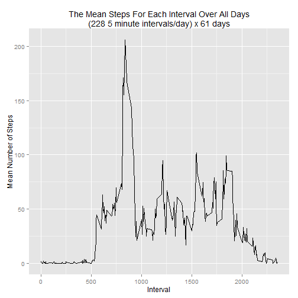
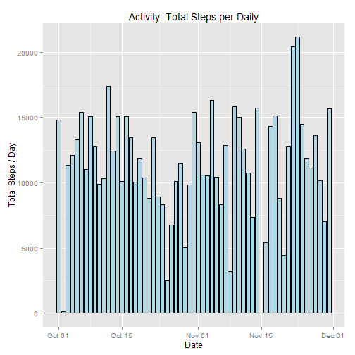
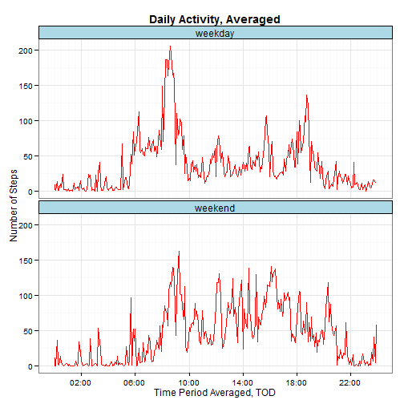
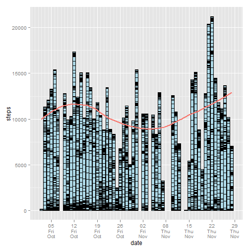

###   $$Reproducible Research - Project 1$$
      
        
    
###    Introduction


It is now possible to collect a large amount of data about personal movement using activity monitoring devices such as a Fitbit, Nike Fuelband, or Jawbone Up. These type of devices are part of the "quantified self" movement - a group of enthusiasts who take measurements about themselves regularly to improve their health, to find patterns in their behavior, or because they are tech geeks. But these data remain under-utilized both because the raw data are hard to obtain and there is a lack of statistical methods and software for processing and interpreting the data.

This assignment makes use of data from a personal activity monitoring device. This device collects data at 5 minute intervals through out the day. The data consists of two months of data from an anonymous individual collected during the months of October and November, 2012 and include the number of steps taken in 5 minute intervals each day.
Data

The data for this assignment can be downloaded from the course web site:

    Dataset: Activity monitoring data [52K]

The variables included in this dataset are:

    steps: Number of steps taking in a 5-minute interval (missing values are coded as NA)

    date: The date on which the measurement was taken in YYYY-MM-DD format

    interval: Identifier for the 5-minute interval in which measurement was taken

The dataset is stored in a comma-separated-value (CSV) file and there are a total of 17,568 observations in this dataset.
Assignment

This assignment will be described in multiple parts. You will need to write a report that answers the questions detailed below. Ultimately, you will need to complete the entire assignment in a single R markdown document that can be processed by knitr and be transformed into an HTML file.

Throughout your report make sure you always include the code that you used to generate the output you present. When writing code chunks in the R markdown document, always use echo = TRUE so that someone else will be able to read the code. This assignment will be evaluated via peer assessment so it is essential that your peer evaluators be able to review the code for your analysis.

For the plotting aspects of this assignment, feel free to use any plotting system in R (i.e., base, lattice, ggplot2)

Fork/clone the GitHub repository created for this assignment. You will submit this assignment by pushing your completed files into your forked repository on GitHub. The assignment submission will consist of the URL to your GitHub repository and the SHA-1 commit ID for your repository state.

NOTE: The GitHub repository also contains the dataset for the assignment so you do not have to download the data separately.

require(knitr)
require(markdown)

knit2html("PA1_template.Rmd", encoding="ISO8859-1")  
markdownToHTML("PA1_template.md", "PA1_template.html")
        
#### load required libraries


```r
library("plyr")
library("ggplot2")
library("lubridate")
library("chron")
library("scales")
library("mice")
```
#### set interval storage, file path and the scientific notation for numeric output


```r
mStepsPerDay <- matrix(nrow=2, ncol=2, 
                       dimnames=list(c("orgSteps","newSteps"),c("mean","median")))
timeForSteps <- matrix(NA, nrow=288, ncol=1, dimnames=list(NULL,"time"))
timeForWeekDaySteps <- matrix(NA, nrow=2*288, ncol=1, dimnames=list(NULL,"time"))

activityDir <- "K:/COURSES/JHU_DataScience/Statistical_Inference"
pathToDataSet <- paste(activityDir, 'activity.csv', sep='/')
options(scipen=999, digits=2)
```
#### load the initial *activity* data


```r
activity <- read.csv(pathToDataSet)    
```
### What is the mean and median total number of steps taken per day?

Before the plot of the 'Total Steps per Day' is displayed, I present a summed version of the dataset for the steps per day, then calculate its mean and median

#### firstly, find the total steps per day - note, there may be missing values

There are 288 intervals of summed, recorded, steps per day, and 61 days for the experiment. Missing data is disregarded


```r
stepsPerDay <- ddply(activity, .(date), summarize, totalSteps=sum(steps, na.rm=TRUE))
```

set the date format of the steps per day


```r
stepsPerDay$date <- as.Date(stepsPerDay$date, "%Y-%m-%d")
```
#### perform the statistic


```r
mStepsPerDay[1,1] <- mean(stepsPerDay$totalSteps)
mStepsPerDay[1,2] <- median(stepsPerDay$totalSteps)
```
The 'activity' data yielded a mean and median of the total steps per day of **9354.23** and **10395**, respectively.

#### 1. make a histogram of the total steps taken each day


```r
    ggplot(stepsPerDay, aes(x=date, y=totalSteps)) +
        geom_bar(fill="lightblue", stat="identity") +
        labs(x="Date", y="Total Steps", title="Total Steps per Day")
```

 


### What is the daily average activity pattern?

Build a table of the average (mean) steps per interval, continue ignoring missing data.


```r
stepsPerInterval <- ddply(activity, .(interval), summarize, avgSteps=mean(steps, na.rm=TRUE))
```
#### 1. make a time series plot of 5-minute intervals vs average steps over the experiment


```r
    ggplot(data=stepsPerInterval, aes(interval, avgSteps)) +
        geom_line(color="black") +
        labs(x="Interval", y="Mean Number of Steps", 
        title="The Mean Steps For Each Interval Over All Days\n(228 5 minute intervals/day) x 61 days")
```

 

#### 2. find the 5-minute interval over all days with the maximum steps

Scan for the bin (interval) with the largest value.

```r
maxstepsPerInterval <- stepsPerInterval$interval[which.max(stepsPerInterval$avgSteps)]
```
The interval with the maximum step counts is **835**

### Imputing missing values

#### 1. determine the number of missing values in the *activity* dataset (and the number of samples)


```r
qMissingActivity <- sum(is.na(activity$steps), na.rm=FALSE) 
totalIntervals <- nrow(activity)
```
Within **17568** samples, there are **2304** missing values. 

#### 2. describe the method for filling in the missing data from the original dataset


MICE, or Generates Multivariate Imputations by Chained Equations:
Generates multiple imputations for incomplete multivariate data by Gibbs sampling. Missing data can occur anywhere in the data. The algorithm imputes an incomplete column (the target column) by generating 'plausible' synthetic values given other columns in the data. Each incomplete column must act as a target column, and has its own specific set of predictors. The default set of predictors for a given target consists of all other columns in the data. For predictors that are incomplete themselves, the most recently generated imputations are used to complete the predictors prior to imputation of the target column. - from RStudio help


#### 3. devise a stategy for filling in the missing data


```r
newActivityNoBlanks <- mice(activity, printFlag=FALSE)
```
#### 4. build a new dataset of equal size, but without missing values


```r
newActivity <- complete(newActivityNoBlanks)
```
#### 5. make a histogram of the modified data for the total steps per day

Built a date summed table of the modified 'activity' data and plot date vs total steps  

```r
    newStepsPerDay <- ddply(newActivity, .(date), summarize, totalSteps=sum(steps))
    newStepsPerDay$date <- as.Date(newStepsPerDay$date, "%Y-%m-%d")
```

Do the TOD format conversion


```r
    activity$date <- format(activity$date)
    activity$date <- as.POSIXct(strptime(paste(activity$date, "00:00:00", sep=" "),"%Y-%m-%d %H:%M:%S")) 
```

Plot the data


```r
    ggplot(newStepsPerDay, aes(x=date, y=totalSteps)) +
        geom_bar(fill="lightblue", color="black", stat="identity") +
        labs(x="Date", y="Total Steps / Day", 
             title="Activity: Total Steps per Daily")
```

 

#### 6. compute the mean and median for the new dataset


```r
mStepsPerDay[2,1] <- mean(newStepsPerDay$totalSteps)
mStepsPerDay[2,2] <- median(newStepsPerDay$totalSteps)
```

For the new dataset, the mean of the total steps per day is **11347.21** and the median is **11458**


##### The following answers the questions for this section of the report:

* Do these values, the new mean and median, differ from the estimates from the first part of the assignment?

* What is the impact of imputtimg missing data on the estimates of the total daily number of steps?
        
The original dataset yielded a mean and median of **9354.23** and **10395**, respectively. After filling in the missing
data, designated by NAs, the mean and median are **11347.21**, and **11458**. The new values, while larger that the 
original numbers, seem reasonable. These empty intervals, which were labeled NA|0, have been filled with new values from the use of the MICE algorithm.


### Are there differences in the activity pattern between weekdays and weekends?


#### 1. make a new factor variable with two levels - weekday and weekend


```r
newActivity$day <- ifelse (weekdays(as.Date(newActivity$date)) %in% 
                                c("Saturday", "Sunday"), "weekend", "weekday")
newActivity$day <- as.factor(newActivity$day)
```
#### 2. make a panel plot

##### The following answers the question for this section of the report:

Inspecting the results of the panel-plot, there is a distinct difference between weekday and weekend. At 8:30 in both time periods, there is some high activity. This can be explained by breakfast behavior, which could be more harried during the work day. After 10:00 for both plots, there is distinct change, especially during the weekend. Some sports or other exercise might explain the activity, while a weekday job can explain the lunch, afternoon break and travel home and dinner increases.


```r
        newStepsPerInterval <- ddply(newActivity, .(interval, day),
                                     summarize, avgSteps=mean(steps, na.rm=TRUE))

        newStepsPerInterval <- cbind(newStepsPerInterval,timeForWeekDaySteps)
        #head(newStepsPerInterval)

        j <- 0
        for (i in 1:nrow(newStepsPerInterval))
        {
        hrsChk <- newStepsPerInterval$interval[i] %% 100
        newStepsPerInterval$time[i] <- as.character(times((hrsChk+60*j)*60/86400))
        
        #skip every other, data is in pairs (weekday, weekend)
        if ((i > 2 & hrsChk == 0) & (i %% 2 == 0))
            j <- j+1
        }
```

ggplot requires that time-date data be in a POSIX format


```r
        newStepsPerInterval$time <- format(newStepsPerInterval$time)
        newStepsPerInterval$time <- as.POSIXct(strptime(paste("2012-10-01", newStepsPerInterval$time, sep=" "),
                                             "%Y-%m-%d %H:%M:%S"))

        ggplot(newStepsPerInterval, aes(x=time, y=avgSteps)) +
            theme_bw() +
            geom_line(color="red") +
            facet_wrap(~day, ncol=1) +
            labs(x="Time Period Averaged, TOD", 
                 y="Number of Steps", 
                 title="Daily Activity, Averaged") +
            theme(plot.title=element_text(lineheight=.8, face="bold"),
            strip.text.x=element_text(size=12),
            strip.background=element_rect(fill="lightblue", color="black")) +
            scale_x_datetime(breaks = '4 hour',  
                             minor_breaks="30 min",
                             labels=date_format('%R')) 
```

 

### Addendum
##### Although this plot is not required, it was interesting and needed to be added to the report. 

Imagine 61 saws, each with 288 uneven teeth. Stack them on top of each other. Each tooth represents an interval count. Moving down the saw-stack in the same tooth position, we have differing heights. These heights, which total 17,568 values (288 x 61) are the original 'activity' file. Each value is represented on the histogram as a line on a bar, 288 lines yields one day. Notice there are indications of more activity at certain time. With these views, it is not possible to tell, only by inspecting each day would the activity periods become clear. A better way to represent this data would be with a 3-D plot.

The red line traces the degree of activity, or 'attraction' and 'repulsion', of values across each interval, pushing up and pulling it down across the plot. 
        

```r
    maxStepsPerInterval <- ddply(activity, .(date), summarize, mSteps=sum(steps, na.rm=FALSE))
    ggplot(data=activity, aes(x=date, y=steps)) + 
        geom_bar(fill="lightblue", color="black", stat="identity") +
        geom_line(data=maxStepsPerInterval, 
                  aes(x=date, y=mSteps, color="red", lwd="2"), 
                  stat="smooth", method="loess") +
        scale_x_datetime(breaks = '7 days', 
                         minor_breaks="1 day", 
                         labels=date_format('%d\n%a\n%b')) +
        theme(legend.position = "none") 
```

 
