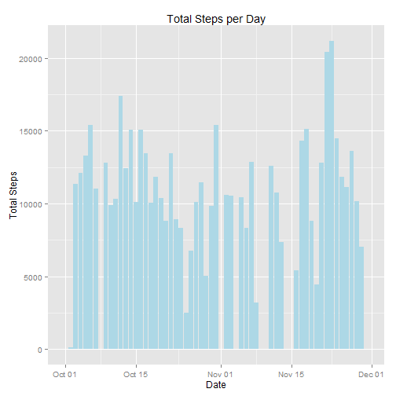
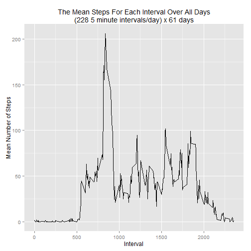
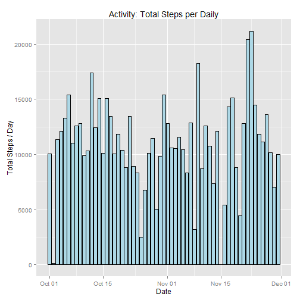

Project 1, Reproducible Research
================================ 
Introduction
------------

It is now possible to collect a large amount of data about personal movement using activity monitoring devices such as a Fitbit, Nike Fuelband, or Jawbone Up. These type of devices are part of the "quantified self" movement - a group of enthusiasts who take measurements about themselves regularly to improve their health, to find patterns in their behavior, or because they are tech geeks. But these data remain under-utilized both because the raw data are hard to obtain and there is a lack of statistical methods and software for processing and interpreting the data.

This assignment makes use of data from a personal activity monitoring device. This device collects data at 5 minute intervals through out the day. The data consists of two months of data from an anonymous individual collected during the months of October and November, 2012 and include the number of steps taken in 5 minute intervals each day.
Data

The data for this assignment can be downloaded from the course web site:

    Dataset: Activity monitoring data [52K]

The variables included in this dataset are:

    steps: Number of steps taking in a 5-minute interval (missing values are coded as NA)

    date: The date on which the measurement was taken in YYYY-MM-DD format

    interval: Identifier for the 5-minute interval in which measurement was taken

The dataset is stored in a comma-separated-value (CSV) file and there are a total of 17,568 observations in this dataset.
Assignment

This assignment will be described in multiple parts. You will need to write a report that answers the questions detailed below. Ultimately, you will need to complete the entire assignment in a single R markdown document that can be processed by knitr and be transformed into an HTML file.

Throughout your report make sure you always include the code that you used to generate the output you present. When writing code chunks in the R markdown document, always use echo = TRUE so that someone else will be able to read the code. This assignment will be evaluated via peer assessment so it is essential that your peer evaluators be able to review the code for your analysis.

For the plotting aspects of this assignment, feel free to use any plotting system in R (i.e., base, lattice, ggplot2)

Fork/clone the GitHub repository created for this assignment. You will submit this assignment by pushing your completed files into your forked repository on GitHub. The assignment submission will consist of the URL to your GitHub repository and the SHA-1 commit ID for your repository state.

NOTE: The GitHub repository also contains the dataset for the assignment so you do not have to download the data separately.

run PA1_driver.R (a wrapper), which starts knit2html, then sets up amd loads required libraries to run the script
-----------------------------------------------------------------------------------------------------------------


```r
library("plyr")
library("ggplot2")
library("lubridate")
library("chron")
library("scales")
library("mice")
```
Set interval storage and file path
----------------------------------


```r
mStepsPerDay <- matrix(nrow=2, ncol=2, dimnames=list(c("orgSteps","newSteps"),c("mean","median")))
timeForSteps <- matrix(NA, nrow=288, ncol=1, dimnames=list(NULL,"time"))

activityDir <- "K:/COURSES/JHU_DataScience/Statistical_Inference"
pathToDataSet <- paste(activityDir, 'activity.csv', sep='/')
```
Load the activity data
----------------------


```r
activity <- read.csv(pathToDataSet)    
```
Find the total steps per day - note, there may be missing values
---------------------------------------------------------------
There are 288 intervals per day and 61 days for the experiment.
All the values for each day by interval are added together.

```r
stepsPerDay <- ddply(activity, .(date), summarize, totalSteps=sum(steps, na.rm=TRUE))
head(stepsPerDay,10)
```

```
##          date totalSteps
## 1  2012-10-01          0
## 2  2012-10-02        126
## 3  2012-10-03      11352
## 4  2012-10-04      12116
## 5  2012-10-05      13294
## 6  2012-10-06      15420
## 7  2012-10-07      11015
## 8  2012-10-08          0
## 9  2012-10-09      12811
## 10 2012-10-10       9900
```
What is the mean and median total number of steps taken per day?
----------------------------------------------------------------


```r
mStepsPerDay[1,1] <- mean(stepsPerDay$totalSteps)
mStepsPerDay[1,2] <- median(stepsPerDay$totalSteps)

print(sprintf("The mean of the total steps per day is: %7.2f, and the median is: %7.2f", 
              mStepsPerDay[1,1], mStepsPerDay[1,2]))
```

```
## [1] "The mean of the total steps per day is: 9354.23, and the median is: 10395.00"
```

set the format for date types

```r
stepsPerDay$date <- as.Date(stepsPerDay$date, "%Y-%m-%d")
head(stepsPerDay$date)
```

```
## [1] "2012-10-01" "2012-10-02" "2012-10-03" "2012-10-04" "2012-10-05"
## [6] "2012-10-06"
```
Make a histogram of the total steps taken each day
--------------------------------------------------


```r
    ggplot(stepsPerDay, aes(x=date, y=totalSteps)) +
        geom_bar(fill="lightblue", stat="identity") +
        labs(x="Date", y="Total Steps", title="Total Steps per Day")
```

 
what is the daily average activity pattern?
===========================================


```r
stepsPerInterval <- ddply(activity, .(interval), summarize, avgSteps=mean(steps, na.rm=TRUE))
```
1. make a time series plot of 5-minute interval vs average steps
----------------------------------------------------------------


```r
    ggplot(data=stepsPerInterval, aes(interval, avgSteps)) +
        geom_line(color="black") +# stat='identity') +
        labs(x="Interval", y="Mean Number of Steps", 
        title="The Mean Steps For Each Interval Over All Days\n(228 5 minute intervals/day) x 61 days")
```

 
2. find the 5-minute interval over all days with the maximum steps
------------------------------------------------------------------

```r
maxstepsPerInterval <- stepsPerInterval$interval[which.max(stepsPerInterval$avgSteps)]
print(sprintf("interval with the maximum counts is: %d", maxstepsPerInterval))
```

```
## [1] "interval with the maximum counts is: 835"
```
Imputting missing values
========================

1. fill in the missing data from the original dataset using 'MICE'
-----------------------------------------------------------------

MICE, or Generates Multivariate Imputations by Chained Equations:
Generates multiple imputations for incomplete multivariate data by Gibbs sampling. Missing data can occur anywhere in the data. The algorithm imputes an incomplete column (the target column) by generating 'plausible' synthetic values given other columns in the data. Each incomplete column must act as a target column, and has its own specific set of predictors. The default set of predictors for a given target consists of all other columns in the data. For predictors that are incomplete themselves, the most recently generated imputations are used to complete the predictors prior to imputation of the target column. - from RStudio help


```r
qMissingActivity <- sum(is.na(activity$steps), na.rm=FALSE) 
print(sprintf("Total missing values: %d", qMissingActivity))
```

```
## [1] "Total missing values: 2304"
```

2. devise a stategy for filling in the missing data
---------------------------------------------------

```r
newActivityNoBlanks <- mice(activity, printFlag=FALSE)
```
3. build a new dataset of equal size, but without missing values
----------------------------------------------------------------

4. make a histogram of the modified data for the total steps per day and calculate the mean and median
------------------------------------------------------------------------------------------------------


```
##         date totalSteps
## 1 2012-10-01      11959
## 2 2012-10-02        126
## 3 2012-10-03      11352
## 4 2012-10-04      12116
## 5 2012-10-05      13294
## 6 2012-10-06      15420
```

```
## [1] "For the new dataset, the mean of the total steps per day is: 10970.85, and the median is: 11162.00"
```
The following answers the questions for this section of the report.
        Do these values (the new mean and median) differ from the estimates from the first part of the assignment?
        What is the impact of imputtimg missing data on the estimates of the total daily number of steps?
        
The original dataset yielded a mean and median of 9354.23 and 11395.00, respectively. After filling in the missing
data, designated by NAs, the mean and median are 11358.25, and 11458.00. The new values, while larger that the 
original numbers, are reasonable as the holes, which were labeled NA, have been filled with new values from the 
use of MICE.


```r
        activity$date <- format(activity$date)
        activity$date <- as.POSIXct(strptime(paste(activity$date, "00:00:00", sep=" "),"%Y-%m-%d %H:%M:%S")) 

        #used for the line, tracing the concentration of values across each interval. Each bar shows
        #288 data points (minus NAs) per day for 61 days (Oct 1 to Nov 30). Imagine 288 saws with 
        #uneven teeth height stacked on top of each other. Each tooth represents an interval, so 
        #moving down the saw-stack in the same tooth position, we have differing heights. These 
        #heights represent the counts for each interval.
        maxStepsPerInterval <- ddply(activity, .(date), summarize, mSteps=sum(steps, na.rm=FALSE))

    ggplot(newStepsPerDay, aes(x=date, y=totalSteps)) +
        geom_bar(fill="lightblue", color="black", stat="identity") +
        labs(x="Date", y="Total Steps / Day", 
             title="Activity: Total Steps per Daily")
```

 

```r
    ggplot(data=activity, aes(x=date, y=steps)) + 
        geom_bar(fill="lightblue", color="black", stat="identity") +
        geom_line(data=maxStepsPerInterval, 
                  aes(x=date, y=mSteps, color="red", lwd="2"), 
                  stat="smooth", method="loess") +
        scale_x_datetime(breaks = '7 days', 
                         minor_breaks="1 day", 
                         labels=date_format('%d\n%a\n%b')) +
        theme(legend.position = "none") 
```

```
## Warning: Removed 8 rows containing missing values (stat_smooth).
## Warning: Removed 2304 rows containing missing values (position_stack).
```

 

```r
        #ggplot(newStepActivity, aes(x=date, y=totalSteps)) +
        #geom_bar(fill="lightgreen", color="black", stat="identity") +
        #labs(x="Date", y="Total Steps / Day", 
        #     title="New Activity: Total Steps per Daily\nmean replaces counts < 250 or NA")
```
Are there differences in the activity pattern between weekdays and weekends?
============================================================================

1. Make a new factor variable with two levels - weekday and weekend
-------------------------------------------------------------------


```r
newActivity$day <- ifelse (weekdays(as.Date(newActivity$date)) %in% 
                                c("Saturday", "Sunday"), "weekend", "weekday")
newActivity$day <- as.factor(newActivity$day)
```
Make a panel plot
-----------------


```r
        newStepsPerInterval <- ddply(newActivity, .(interval, day),
                                     summarize, avgSteps=mean(steps, na.rm=TRUE))

        ggplot(newStepsPerInterval, aes(x=interval, y=avgSteps)) +
            theme_bw() +
            geom_line(color="red") +
            facet_wrap(~day, ncol=1) +
            labs(x="Interval", y="Number of Steps", title="Daily Activity, Averaged") +
            theme(plot.title=element_text(lineheight=.8, face="bold"),
            strip.text.x=element_text(size=12),
            strip.background=element_rect(fill="lightblue", color="black"))
```

 
